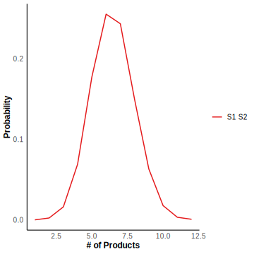
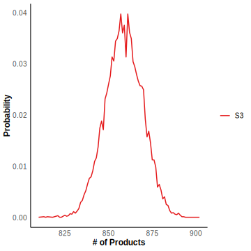

# DelaySSA
DelaySSA is an R package designed to simulate non-Markovian models of gene expression using a delayed the Gillespie algorithm. This package is particularly useful for researchers and practitioners in computational biology and systems biology who are interested in modeling the dynamics of gene expression with intrinsic delays.

## Features
- Implementation of the delayed Gillespie algorithm [1-4].
- Support for modeling gene expression with various delay distributions.
- Easy-to-use interface for defining reactions with delays.
- Capability to handle complex gene regulatory networks.
- Visualization tools for analyzing simulation results.

## Installation
Download the installation package from GitHub
```
devtools::install_github("Zoey-JIN/DelaySSA")
```

Or download and install locally
```
devtools::install("~/DelaySSA")
```

Then load the package
```
library("DelaySSA")
```

<!-- ## Example
Molecular $S_1$ binds $S_2$ and then disappear with the reaction rate $k_1$. Once the reaction occurs, the molecular $S_3$ will be generated after a fixed time delay $\tau$, and will degrade with the rate $k_2$. 
$$S_1+S_2 \xrightarrow{k_1}\emptyset,~~\emptyset\stackrel{\tau}\Rightarrow S_3,\\
S_3 \xrightarrow{k_2}\emptyset.$$

The species are $S_1,S_2,S_3$. Let $k_1=0.001, k_2 = 0.001，\tau = 0.1.$

```R
tmax <- 150
n_initial <- matrix(c(1000,1000,0),nrow = 3)
t_initial <- 0
S_matrix <- c(-1,-1,0,0,0,-1)
S_matrix <- matrix(S_matrix,nrow = 3) 
S_matrix_delay <- c(0,0,1,0,0,0)
S_matrix_delay <- matrix(S_matrix_delay,nrow = 3)
k <- c(0.001,0.001)
reactant_matrix <- matrix(c(1,1,0,0,0,1),nrow = 3)
delay_type <- matrix(c(2,0),nrow = 1)
delaytime_list <- list()
delaytime_list <- append(delaytime_list,0.1)
delaytime_list <- append(delaytime_list,0)
```

Simulate $10^4$ times and calculate the mean value for all the molecule species and probability distribution of $S_3$ at $t = 150$. The number of $S_1$ is the same as the number of $S_2$ at any time.

```R
sample <- 10000
result <- simulation_DelaySSA(algorithm = "DelayMNR", sample_size=sample, tmax=tmax, n_initial=n_initial, t_initial=t_initial, S_matrix=S_matrix, S_matrix_delay=S_matrix_delay, k=k, reactant_matrix=reactant_matrix, delay_type=delay_type , delaytime_list=delaytime_list)
plot_SSA_mean(result = result,t=seq(0, tmax, by = 1) ,n_initial = n_initial,t_initial = 0)
plot_SSA_density(result = result,t_pick = tmax)
``` -->

# Tutorial Example : Delayed Production and Annihilation System
This tutorial is designed to demonstrate how to use DelaySSA for defining chemical reaction models, solving related problems, and visualizing the results. The source code for all examples and figures can be found in the GitHub examples folder. We study the system with two non-delay channels and one delay channel. This model describes that molecular $S_1$ binds $S_2$ and then degrade with the reaction rate $k_1$. Once the reaction occurs, the molecular $S_3$ will be generated after a fixed time delay $\tau$, and will degrade with the rate $k_2$. This procedure can be described by

$$
S_1+S_2 \xrightarrow{k_1}\emptyset,~~\emptyset\stackrel{\tau}\Rightarrow S_3\\
S_3 \xrightarrow{k_2}\emptyset.
$$

The species are $S_1,S_2,S_3$. Let $k_1=0.001, k_2 = 0.001，\tau = 0.1.$

## Initialization Part
Assume reactions occur in this system from `t_initial=0` to `tmax=150`, repeating this process for `sample=1000` times. The initial quantities of $S_1,S_2$ and $S_3$ are 1000, 1000, and 1, respectively.

```R
sample <- 1000
tmax <- 150
n_initial <- matrix(c(1000,1000,0),nrow = 3)
t_initial <- 0
```
According to the reactions, the counting of reactant and product molecules rows is arranged with rows indexed as $S_1,S_2,S_3$, and columns indexed in order of the reactions. $s_{ir}$ and $s_{ir}'$ denote numbers of reactant and product molecules, respectively. Then, we define $s$ as `reactant_matrix` and $s'$. Therefore, we can define $S$ as `S_matrix`. For delay part, we can define $S_\text{delay}$ as `S_matrix_delay`, which can be expressed as

$$s=\begin{pmatrix} 1 & 0 \\ 1 & 0 \\ 0 & 1 \end{pmatrix},~ s'=\begin{pmatrix}0 & 0 \\0 & 0 \\0 & 0\end{pmatrix}, ~ S=s'-s=\begin{pmatrix} -1 & 0 \\ -1 & 0 \\0 & -1 \end{pmatrix},~ S_\text{delay}=\begin{pmatrix} 0 & 0 \\0 & 0 \\1 & 0\end{pmatrix}$$

```R
S_matrix <- c(-1,-1,0,0,0,-1)
S_matrix <- matrix(S_matrix,nrow = 3) 
> S_matrix
     [,1] [,2]
[1,]   -1    0
[2,]   -1    0
[3,]    0   -1

S_matrix_delay <- c(0,0,1,0,0,0)
S_matrix_delay <- matrix(S_matrix_delay,nrow = 3)
> S_matrix_delay
     [,1] [,2]
[1,]    0    0
[2,]    0    0
[3,]    1    0

k <- c(0.001,0.001)
reactant_matrix <- matrix(c(1,1,0,0,0,1),nrow = 3)
> reactant_matrix
     [,1] [,2]
[1,]    1    0
[2,]    1    0
[3,]    0    1
```
The reactions are categorized as ICD and ND, with `delay_type` corresponding to `2` and `1` respectively. `delaytime_list` records the delay times of the reactions. The first reaction will trigger a delay reaction that will happen after $\tau = 0.1$ seconds. The second reaction will not trigger a delay reaction, thus a `0` is added to `delaytime_list`. 
```R
tau = 0.1
delay_type <- matrix(c(2,0),nrow = 1)
delaytime_list <- list()
delaytime_list <- append(delaytime_list,c(tau,0))
```

## Simulation and Visualization Part
Next, use the function `simulation_DelaySSA` from the package to calculate the quantities of substances after reactions occur and the corresponding times for each reaction
```R
result <- simulation_DelaySSA(algorithm = "DelayMNR", sample_size=sample, tmax=tmax, n_initial=n_initial, t_initial=t_initial, S_matrix=S_matrix, S_matrix_delay=S_matrix_delay, k=k, reactant_matrix=reactant_matrix, delay_type=delay_type , delaytime_list=delaytime_list)
```
Sampling times are taken as `seq(0, tmax, by = 1)`. Use `plot_SSA_mean` to calculate and plot the mean values in the quantities of each substance at these time points. At time `tmax`, use `plot_SSA_density` to calculate and plot the probability distribution of the quantities of each substance. Here the number of $S_1$ is the same as the number of $S_2$.
```R
plot_SSA_mean(result = result,t=seq(0, tmax, by = 1) ,n_initial = n_initial,t_initial = 0)
plot_SSA_density(result = result,t_pick = tmax)
```






## Main API
`algorithm`  
The alternative algorithm must be one of `DelayMNR` (default), `DelayReject`, or `DelayDirect`. Traditional stochastic simulation including `Direct`, `MNR` and `NR`  are recommended and the parameters of `S_matrix_dalay` `delay_type` and `delaytime_list` can be omitted.

`sample_size`  
A numeric value representing trajectories for the system.

`tmax`  
A numeric value representing the cut-off time for the system.

`n_initial`  
An N-by-1 matrix representing the initial quantity of species, where N corresponds to the number of molecular species.

`t_initial`  
A numeric value representing the initial time for the system.

`S_matrix`  
An N-by-R matrix, where N corresponds to the number of species types and R corresponds to the number of reactions. It represents the stoichiometric matrix at the initiation time $t$, denoting the change in the number of molecules per reaction.

 <!-- which is only relevant for the type of ND and ICD reactions. If it is CD reactions, the corresponding column is filled with zeros. -->

`S_matrix_dalay`  
An N-by-R matrix, representing the stoichiometric matrix at the completion time $t+t_\text{delay}$, which is only relevant for the delayed type of CD and ICD reactions. If it is not a delay reaction namely ND reactions, the corresponding column is filled with zeros.

`k`  
An R-dimensional vector representing the reaction constant rate or a function representing the variable rate.

`reactant_matrix`  
An N-by-R matrix, representing the quantity of reactants.

`f_r`  
A function determined by $k$ and $n$. `f_r` represents the propensity function.

`delay_type`  
An R-dimensional vector or a 1-by-R matrix representing the type of the reactions. It is a numerical vector, where each element can take on the values `0`, `1`, or `2`. Here `0` represents ND, `1` represents CD and `2`represents ICD.

`delaytime_list`  
An R-dimensional list representing the delay time of the reactions. Every element can be a fixed number or a stochastic value governed by a function.

`delay_effect_matrix`  
A 2-row matrix. The first row represents the reaction index of `S_matrix`, the second row represents the reaction index of `S_matrix_dalay`. If not empty, each column of the matrix links `S_matrix` and `S_matrix_delay`: the first row shows the column index $r$ from `S_matrix`, while the second row shows the corresponding column index $r$' from `S_matrix_delay`, where both columns are the same. This will cause the $r$'-th reaction in delay part to be randomly eliminated when the $r$-th reaction in `S_matrix` occurs called interruption.

# Function
<table style="margin: auto; width: auto; border-collapse: collapse;">
  <tr>
    <th style="text-align: left; padding: 5px;">Function</th>
    <th style="text-align: left; padding: 5px;">Description</th>
  </tr>
  <tr>
    <td style="text-align: left; padding: 5px;">check_delay_relative*</td>
    <td style="text-align: left; padding: 5px;">Delay Effect Matrix</td>
  </tr>
  <tr>
    <td style="text-align: left; padding: 5px;">convert_pdf</td>
    <td style="text-align: left; padding: 5px;">Probability Density Functions Conversion</td>
  </tr>
  <tr>
    <td style="text-align: left; padding: 5px;">fun_fr</td>
    <td style="text-align: left; padding: 5px;">Propensity Function</td>
  </tr>
  <tr>
    <td style="text-align: left; padding: 5px;">picksample</td>
    <td style="text-align: left; padding: 5px;">Results Sampling</td>
  </tr>
  <tr>
    <td style="text-align: left; padding: 5px;">plot_mean</td>
    <td style="text-align: left; padding: 5px;">The Mean Value of Species i at Time t</td>
  </tr>
  <tr>
    <td style="text-align: left; padding: 5px;">plot_SSA_density*</td>
    <td style="text-align: left; padding: 5px;">Density at Time t_pick</td>
  </tr>
  <tr>
    <td style="text-align: left; padding: 5px;">plot_SSA_mean*</td>
    <td style="text-align: left; padding: 5px;">Mean of Species over Time</td>
  </tr>
  <tr>
    <td style="text-align: left; padding: 5px;">propensity_n</td>
    <td style="text-align: left; padding: 5px;">For Propensity Calculation</td>
  </tr>
  <tr>
    <td style="text-align: left; padding: 5px;">simulate_reaction*</td>
    <td style="text-align: left; padding: 5px;">Gillespie Algorithm</td>
  </tr>
  <tr>
    <td style="text-align: left; padding: 5px;">simulate_reaction_delay_direct*</td>
    <td style="text-align: left; padding: 5px;">Delay Direct Method Algorithm</td>
  </tr>
  <tr>
    <td style="text-align: left; padding: 5px;">
    simulate_reaction_delay_modifiednextreaction*</td>
    <td style="text-align: left; padding: 5px;">Delay Modified Next Reaction Method Algorithm</td>
  </tr>
  <tr>
    <td style="text-align: left; padding: 5px;">simulate_reaction_delay_rejection*</td>
    <td style="text-align: left; padding: 5px;">Delay Rejection Method Algorithm</td>
  </tr>
  <tr>
    <td style="text-align: left; padding: 5px;">simulate_reaction_modifiednextreaction*</td>
    <td style="text-align: left; padding: 5px;">Modified Next Reaction Method Algorithm</td>
  </tr>
  <tr>
    <td style="text-align: left; padding: 5px;">simulate_reaction_nextreaction*</td>
    <td style="text-align: left; padding: 5px;">Next Reaction Method Algorithm</td>
  </tr>
  <tr>
    <td style="text-align: left; padding: 5px;">simulation_DelaySSA*</td>
    <td style="text-align: left; padding: 5px;">Simulation Algorithm (SSA) with Delays</td>
  </tr>
    <tr>
    <td style="text-align: left; padding: 5px;">tau_element</td>
    <td style="text-align: left; padding: 5px;">Delay Time </td>
  </tr>
</table>
<p style="text-align: right; padding: 5px;">* This function can be used independently.</p>

# Basic Concepts
Biological processes encompass a multitude of intricate mechanisms involving various molecules and physical interactions. By conceptualizing these processes as a series of discrete chemical reactions, we can mathematically formalize them. This mathematical representation enables precise modeling of the reaction dynamics and facilitates accurate predictions of reactant quantities.

Stochastic Simulation Algorithm (SSA) [1] is a method used to simulate stochastic processes in chemical reaction systems. This algorithm is particularly suitable for systems with a small number of molecules.

However, some chemical reactions, such as gene transcription and translation within living cells, necessitate a defined temporal duration to reach completion following their initiation. As a result, the products of these reactions will manifest only after a time delay which makes the traditional SSA algorithm unsuitable for these reactions. DelaySSA implements a stochastic simulation algorithm (SSA) with delays in R language. It can simulate chemical reaction systems both with and without delays. now DelaySSA supports three exact delay stochastic simulation algorithms, namely, delay direct method `DelayDirect` [2], delay rejection method DelayRejction `DelayReject` [3] and delay modified next reaction method `DelayMNR` [4]. Here we give the basic concepts of these algorithms.

Given a finite set of chemical species $X_i, i = 1, \ldots,N,$ and $R$ chemical reactions, we define the reactions by the notation  

$$
\sum_{i=1}^{N} s_{ir}X_i \xrightarrow{k_r} \sum_{i=1}^{N} s^{'}_{ir}X_i,~~r=1, \ldots,R,
$$  

where $s_{ir}$ and $s'_{ir}$ denote numbers of reactant and product molecules, respectively. $ k_r $ is the reaction rate constant of the $r$-th reacion. And the stoichiometric matrix $S$ is given by
$$S_{ir}=s^{'}_{ir}-s_{ir},~~r=1, \ldots,R,~~i=1, \ldots,N.$$

According to [5], propensity function $f(\textbf{n})$ are in the form of mass-action kinetics type

$$f_r(\textbf{n})_=k_r \Omega \prod_{i=1}^{N} \frac{n_i!}{(n_i-s_{ir})! \Omega^{s_{ir}}},$$

where $\textbf{n} = \left( n_1, \ldots, n_N \right)$, $n_i$ is the number of species $X_i$, $\Omega$ is the volume of a closed compartment.

The time delay could be a fixed number or a stochastic value. According to [3], reactions with delays are categorized into consuming and nonconsuming reactions. If a delayed reaction is a nonconsuming reactions, it initiates at $t$ and will finish until $t+t_\text{delay}$, then the $\textbf{n}$ of the number of species will change only at $t+t_\text{delay}$. If a delayed reaction is a consuming reactions, it initiates at $t$ and will finish until $t+t_\text{delay}$, then the $\textbf{n}$ of the number of species will change both at $t$ and $t+t_\text{delay}$.

We can categorize reactions into the following three cases.

Case 1: If reaction $r$ loses the reactant species and gains the product species at the initiation time $t$, we define the reaction $r$ with no delays as ND.

Case 2: If reaction $r$ loses the reactant species and gains the product species at the completion time $t+t_\text{delay}$, we define the reaction $r$ with delays as CD.

Case 3: If reaction $r$ loses the reactant species and gains the product species at the initiation time $t$ and the completion time $t+t_\text{delay}$, respectively, we define the reaction $r$ with delays as ICD.

# Delay Direct Method Algorithm
Consider that $N_d$ delay reactions are ongoing at the time $t$. The delay reactions will complete at $t+T_1,\ldots,t+T_{N_d}$, where $T_1 \leq T_2,\ldots,t+T_{N_d}$. As in the derivation of Gillespie’s exact Stochastic Simulation Algorithm (SSA), $p(\tau, \nu) d\tau$ can be found from the fundamental assumption as $p(\tau, \nu) d\tau = p_0(\tau) f_\mu(t + \tau) d\tau$, where $p_0(\tau)$ is the probability that no reaction will happen in the time interval $[t,t+\tau)$. The delay effects the propensity function. So $p_0(\tau)$ comes to $\exp(-\Sigma_{j=0}^{i-1}\lambda(t+T_j)(T_{j+1}-T_j)-\lambda(t+T_i)(\tau-T_{i})),~~\tau \in [T_i, T_{i+1}), ~~i=0,\ldots,N_d$, where the exponent assume equal to zero when $i=0$.

$$p(\tau|\textbf{n},t)=\lambda(t + T_i) \exp ( - \sum_{j=0}^{i-1} \lambda(t + T_j)(T_{j+1} - T_j) - \lambda(t + T_i)(\tau - T_i) ),~~\lambda(t + T_i)=\sum_{r=1}^{R} f_r(t + T_i),$$

$$p(\mu|\textbf{n},t)=f_r(t + T_i)/\lambda(t + T_i),~~\mu= 1, \ldots,R, ~~\tau \in [T_i, T_{i+1}), ~~i=0,\ldots,N_d.$$
According this two equations, $\tau$ and $\mu$ can be generated as,
$$\tau=T_i+\frac{-\ln(1-u_1)-\Sigma_{j=0}^{i-1} \lambda(t + T_j)(T_{j+1} - T_j)}{\lambda(t + T_i)} ,$$
$$\mu=\text{the integer satisfies $\sum_{r=1}^{\mu-1} f_r(t + T_i)< u_2 \lambda (t + T_i) \leq \sum_{r=1}^{\mu} f_r(t + T_i)$},$$
where $u_1,u_2\sim \text{Uniform}(0,1)$ respectively.

## Algorithm

Suppose that at time $t$ there are ongoing delayed reactions set to complete at times $t+T_1, t+T_2, \ldots, t+T_d$. Define $T_0=0$ and $T_{d+1}=\infty$.

Define *Tstruct*, whose $i$-th $(i=1,\dots,d)$ row stores $T_i$ and the index, $\mu_i$, of the reaction that $T_i$ is associated with.

 1. Initialize. Set $t=0$ and set species number $n = n_\text{initial}$. Create a empty *Tstruct*.

 2. Calculate propensity functions $f_r(t), r=1, \ldots,R$. 

 3. Generate  $\tau$.
    
      - Generate an independent $\text{Uniform}(0,1)$ random number $u_1$

      - If *Tstruct* is empty, it means there is no ongoing delayed reaction
          - set $\tau = -\ln(u_1)/ \Sigma_{r=1}^{R}f_r$.

      - Else

          - set $a_\text{mask}=0$

          - Set $i=0$, $F=0$ and $a_t = \Sigma_{r=1}^{R} f_rT_1$.
        
          - While $F < u_1$
              
              - Calculate $F=1-e^{-a_t},i=i+1$.

              - Calculate propensity $f_r(t+T_i)$ due to the finish of the delayed reaction at $t+T_{i}$ and calculate $\Sigma_{r=1}^{R}f_r(t+T_i)$.           

              - Set $a_{mask}=a_t$. Update $a_t=a_t+\Sigma_{r=1}^{R}f_r(t+T_i)(T_{i+1}-T_i)$.

              - If $i>1$, update species number $n$ due to the delay reaction at $t+T_{i-1}$

          - EndWhile

          - Set $i=i-1$.

          - Calculate $\tau=T_i-(\ln(1-u_1)+a_\text{mask}-\Sigma_{r=1}^{R}f_r(t+T_i)(T_{i+1}-T_i))/\Sigma_{r=1}^{R}f_r(t+T_i)$.

      - EndIf

 4. If $\tau\in[T_i,T_{i+1})$, delete the columns $1,\ldots,i$ of $T_i$ and set $T_j=T_j-\tau$.

 5. Generate $u_2$ from a uniform(0,1) random variable, and find the integer $\mu$ which satisfies $\Sigma_{r=1}^{\mu-1} f_r< u_2 \Sigma_{r=1}^{R} f_r \leq \Sigma_{r=1}^{\mu} f_r$.

 6. Update according to the type of reaction $\mu$ belongs to: if the reaction $\mu$ belongs to type ND, update species number $\textbf{n}$; if the reaction belongs to type CD, store the time $t+\tau_\mu$; if the reaction belongs to type ICD, update species number $\textbf{n}$ and store the time $t+\tau_\mu$. If it is a delay reaction, insert $\tau_\mu$ and the reaction $\mu$ into *Tstruct*, ensuring that the times in *Tstruct* remain in ascending order.

 7. Set $t=t+\tau$.

 8. Return to Step 3 or quit.

Remark. Notice that in the above pseudocode, we modified the Step 4 in the original algorithm for computational efficiency, but both are equivalent. More details are illustrated in [2].

# Delay Modified Next Reaction Method Algorithm

 Delay Modified Next Reaction Method Algorithm is modified Next Reaction Method to systems with delays. According to [4], if $T_r$ is the current internal time of $Y_r$, $P_r$ the first internal time after $T_r$ at which $Y_r$ fires, and the propensity function for the $r$-th reaction channel is given by $f_r$, then the time until the next initiation of reaction $r$ (assuming no other reactions initiate or complete) is still given by $\Delta t_r = (1/f_r)(P_r − T_r)$.  To each delayed reaction channel we therefore assign a vector, $s_r$, that stores the completion times of that reaction in ascending order. Thus, the time until there is a change in the state of the system, be it an initiation or a completion, will be given by
$$\Delta=\min\{\Delta t_r, s_r[1]-t\}$$
 where $t$ is the current time of the system.

## Algorithm

 1. Initialize. Set $t=0$ and set species number $n= n_\text{initial}$. For each $r \leq R$, set $P_r = 0$, $T_r = 0$, and $s_r = [\infty]$.

 2. Calculate the propensity function, $f_r$, for each reaction.

 3. Generate $R$ independent, $\text{Uniform}(0,1)$ random numbers, $u_r$, and set $P_r = -\ln(u_r)$.

 4. Set $\tau_r = (P_r − T_r)/f_r$.

 5. Set $\tau = \min_r \{  \tau_r , s_r[1]-t \}$

 6. Set $t = t + \tau$.

 7. If choose the completion of the delayed reaction $\mu$:

      - Update species number $n$ based upon the completion of the reaction $\mu$.

      - Delete the first element of $S_\mu$.

 8. Elseif reaction $\mu$ initiated and $\mu\in \text{ND}$

      - Update species number $n$ according to reaction $\mu$.

 9. Elseif reaction $\mu$ initiated and $\mu\in \text{CD}$

      - Update $s_\mu$ by inserting $t + \tau_\mu$ into $s_\mu$ ensuring that the times in $s_\mu$ remain in ascending order.

 10. Elseif reaction $\mu$ initiated and $\mu\in \text{ICD}$
    
      - Update species number $n$ based upon the initiation of reaction $\mu$.

      - Update $s_\mu$ by inserting $t + \tau_\mu$ into $s_\mu$ ensuring that the times in $s_\mu$ remain in ascending order.

 11. For each r, set $T_r = T_r + f_r \tau$.

 12. If reaction $\mu$ initiated, let $u'$ be uniform$(0,1)$ and set $P_\mu = P_\mu - \ln(u')$.

 13. Recalculate the propensity functions, $f_r$.

 14. Return to step 4 or quit.

# Delay Rejection Method Algorithm

 Based upon the non-delay algorithm, we see that simulation methods for systems with delays need to calculate when reactions initiate and store when they complete. However, because of the delayed reactions, the propensity functions can change between initiation times. [3] used an algorithm for computing the initiation times that is exactly like the original Gillespie Algorithm except that if there is a stored delayed reaction set to finish within a computed timestep, then the computed timestep is discarded, and the system is updated to incorporate the stored delayed reaction. The algorithm then attempts another step starting at its new state. This algorithm will be referred to as the Rejection Method.


## Algorithm

 1. Initialize. Set $t = 0$ and set species number $n= n_\text{initial}$.

 2. Calculate propensity functions $f_r(t), r=1, \ldots,R$. 

 3. Generate $u_1$ from a uniform(0,1) random variable, and set $\tau = -\ln(u_1)/\Sigma_{r=1}^{R} f_r$.

 4. If there is a delayed reaction to finish in $[t,t+\tau)$
    - Discard $\tau$.
    - Update $t$ to be the time of the first next delayed reaction and update the species number.
    - Return to step 2 or quit

 5. Else if there is no delayed reaction in $[t,t+\tau)$. 
    - Generate $u_2$ from a uniform(0,1) random variable, and find the integer $\mu$ which satisfies $\Sigma_{r=1}^{\mu-1} f_r< u_2 \Sigma_{r=1}^{R} f_r \leq \Sigma_{r=1}^{\mu} f_r$.

 6. Update according to the type of reaction $\mu$ belongs to: if the reaction $\mu$ belongs to type ND, update species number $\textbf{n}$; if the reaction belongs to type CD, store the time $t+\tau_\mu$; if the reaction belongs to type ICD, update species number $\textbf{n}$ and store the time $t+\tau_\mu$.

 7. Set the time $t= t+\tau$.

 8. Return to step 2 or quit.

# Gillespie Algorithm

 Consider a system of $N$ chemical substances with $R$ ongoing chemical reactions, each of which has a corresponding tendency function $f_r(n)$. The Gillespie algorithm assumes that the time from start to finish for each reaction is negligible. Through random simulations, calculate 1) how much time will pass before the next reaction occurs (i.e. starts and finishes), and 2) which reaction will occur at that future point in time. The following assumptions, sometimes referred to as the basic premises of chemical dynamics, are based on physical principles and serve as the underlying assumptions for methods of simulating chemical reaction systems [1]:
$$f_r(n(t)) dt = \text{the probability that  reaction r takes place in a small time interval} ~[t, t + dt)$$

Based on this  fundamental assumptions,  $\tau$ and $\mu$ are two independent random variables and following the probability density functions as:
$$p(\tau|n,t)=\lambda(n,t) \exp(-\tau \lambda(n,t)), ~~\lambda=\sum_{r=1}^{R} f_r(n,t),$$
$$p(\mu|n,t)=f_r(n,t)/\lambda(n,t) .$$
According this two equations, $\tau$ and $\mu$ can be generated as,
$$\tau=-\ln(u_1)/\lambda(n,t),$$
$$\mu=\text{the integer satisfies $\sum_{r=1}^{\mu-1} f_r(n,t)< u_2 \lambda(n,t) \leq \sum_{r=1}^{\mu} f_r(n,t)$},$$
where $u_1,u_2\sim \text{Uniform}(0,1)$ respectively.

<!-- [Approximate accelerated stochastic simulation of chemically reacting systems]
[Improved leap-size selection for accelerated stochastic simulation] -->


## Algorithm

 1. Initialize. Set $t = 0$ and set species number $n= n_\text{initial}$. 

 2. Calculate the propensity function, $f_r$, for each reaction.

 3. Generate two independent, uniform $(0,1)$ random numbers, $u_1$ and $u_2$.

 4. Set $\tau = -\ln(u_1)/\Sigma_{r=1}^{R} f_r$.

 5. Find the integer $\mu$ which satisfies $\Sigma_{r=1}^{\mu-1} f_r< u_2 \Sigma_{r=1}^{R} f_r \leq \Sigma_{r=1}^{\mu} f_r$.

 6. Set $t = t + \tau$.

 7. Update species number $n$ based upon the completion of the reaction $\mu$.

 8. Return to step 2 or quit.


# The Next Reaction Method Algorithm
 
 Let $v_r$, $v'_r\in N{\geq 0}^N$ be the vectors representing the number of each species consumed and created in the *r*th reaction, respectively. Then, if $N_r(t)$ is the number of initiations of reaction $r$ by time $t$, the state of the system at time $t$ is

$$n(t)=n(0)+\sum_{r=1}^R{N_r(t)(v'_r-v_r)}.$$

 However, based upon the fundamental assumption of stochastic chemical kinetics, $N_r(t)$ is a counting process with intensity $f_r(n(t))$ such that $p(N_k(t+\Delta t)-N_k(t)=1)=f_r(n(t))\Delta t$, for small $\Delta t$. Therefore, we have

$$
N_r(t)=Y_r\Big(\int^t_0f_r(n(s))ds\Big),
$$

where the $Y_r$ are independent, unit rate Poisson processes. 

Each Poisson process $Y_r$ brings its own time frame. If we define $T_r(t)=\int^t_0f_r(n(s))ds$ for each $r$, then it is relevant for us to consider $Y_r(T_r(t))$. We will call $T_r(t)$ the "**internal time**" for reaction $r$.

$\Delta t_r$ notes the gap time which the *r*th reaction needs. $\Delta=\min_r { \Delta t_r }$. For the moment we denote $\overline{t} = t +\Delta$ and the updated propensity functions by $\overline{f_r}$. 

The internal time of the next firing of $Y_r$ has not changed and is still given by $T_r(t) + f_r \Delta t_r$. We also know that the updated internal time of $Y_r$ is given by $T_r(\overline{t}) =T_r(t)+ f_r \Delta $. Therefore, the amount of internal time that must pass before the *r*th reaction fires is given as the difference:
$$(T_r(t) + f_r \Delta t_r) − (T_r(t)+ f_r \Delta ) = f_r(\Delta t_r − \Delta).$$
Thus, the amount of absolute time that must pass before the *r*th reaction channel fires,$ \Delta \overline{t}_r$, is given as the solution to $\overline{f_r}\Delta \overline{t}_r = f_r(\Delta t_r − \Delta)$, and we can get:
```math
\overline{\tau_r} = f_r / \overline{f_r}  (\Delta t_r − \Delta) + \overline{t}
    = f_r / \overline{f_r}  ((t+\Delta t_r )− (t+\Delta)) + \overline{t}
    = f_r / \overline{f_r}  (\tau_r − \overline{t}) + \overline{t}
```

We have therefore found the absolute times of the next firings of reactions $r = µ$ without having to generate any new random numbers.

 Note that after the first timestep is taken in the Next Reaction Method, all subsequent timesteps only demand one random number to be generated.  The Next Reaction Method developed with the notion of a dependency graph and a priority queue in order to increase computational efficiency [6]. This is similar with random numbers needed for each step of the original Gillespie Algorithm.

## Algorithm

 1. Initialize. Set $t=0$ and set species number $n= n_\text{initial}$. 

 2. Calculate the propensity function, $f_r$, for each reaction.

 3. Generate $R$ independent, $\text{Uniform}(0,1)$ random numbers, $u_r$.

 4. set $\tau_r = -\ln(u_r)/ f_r$.

 5. Set $t = \min_r \{ \tau_r \}$. Here we assume that $\tau_\mu$ is the minimum.

 6. Update species number $n$ based upon the completion of the reaction $\mu$.

 7. Recalculate the propensity function, $\overline{f_r}$, for each reaction.

 8. For each $r \neq \mu$, set $\tau_r=(f_r/\overline{f_r})(\tau_r-t)+t$.

 9. For reaction $\mu$, let $u'$ be uniform $(0,1)$ and set $\tau_\mu=-\ln(u')/\overline{f_
 \mu}+t$. If $\tau_r$ is either $NA$ or $Inf$, it also needs to be recalculated in this manner.

 10. For each r, set $f_r = \overline{f_r}$.

 11. Return to step 5 or quit.


# Modified Next Reaction Method Algorithm
According to [4], Modified Next Reaction Method Algorithm that is completely equivalent to Next Reaction Method Algorithm. But  but makes more explicit use of the internal times $T_r$. The main idea of this algorithm is $\Delta t_r = (1/f_r)(P_r − T_r)$.

## Algorithm

 1. Initialize. Set $t = 0$ and set species number $n= n_\text{initial}$. For each $r\leq R$, set $P_r = 0$ and $T_r = 0$.

 2. Calculate the propensity function, $f_r$, for each reaction.

 3. Generate $R$ independent, uniform $(0,1)$ random numbers, $u_r$, and set $P_r = -\ln(u_r)$.

 4. Set $\tau_r = (P_r − T_r)/f_r$.

 5. Set $\tau = \min_r \{  \tau_r \}$. Here we assume that $\tau_\mu$ is the minimum.

 6. Set $t = t + \tau$. And update species number $n$ based upon the completion of the reaction $\mu$.

 7. For each r, set $T_r = T_r+f_r\tau$.

 8. For reaction $\mu$, let $u'$ be uniform $(0,1)$ and set $P_\mu = P_\mu - \ln(u')$.

 9. Recalculate the propensity function, $f_r$, for each reaction.

 10. Return to step 5 or quit.

 ## References

[1]Gillespie, D. T. (1977). Exact stochastic simulation of coupled chemical reactions. The journal of physical chemistry, 81(25), 2340-2361.

[2] Cai, X. (2007). Exact stochastic simulation of coupled chemical reactions with delays. The Journal of chemical physics, 126(12).

[3] Barrio, M., Burrage, K., Leier, A., & Tian, T. (2006). Oscillatory regulation of Hes1: discrete stochastic delay modelling and simulation. PLoS computational biology, 2(9), e117.

[4] Anderson, D. F. (2007). A modified next reaction method for simulating chemical systems with time dependent propensities and delays. The Journal of chemical physics, 127(21).

[5] Van Kampen, N. G. (1992). Stochastic processes in physics and chemistry (Vol. 1). Elsevier.

[6] Gibson, M. A., & Bruck, J. (2000). Efficient exact stochastic simulation of chemical systems with many species and many channels. The journal of physical chemistry A, 104(9), 1876-1889.


