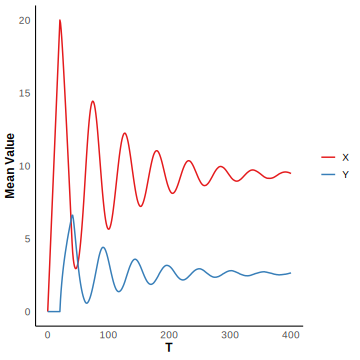
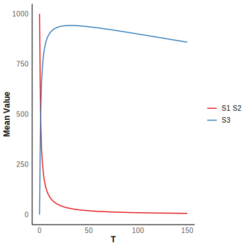
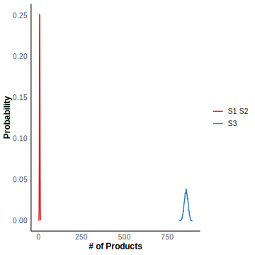

# Oscillation Model

In this section, we will give an example to illustrate the use of DelaySSA for defining chemical reaction models, solving associated problems, and visualizing the results. The source code for all examples and figures can be found in the GitHub examples folder. We focus on a specific case known as the Oscillation model, which involves the following steps: (i) a protein $X$ is transcribed by a promoter, (ii) after a fixed time delay $\tau$, $X$ is converted into protein $Y$ through a series of unspecified biochemical processes, and (iii) $Y$ then binds to the promoter, reducing the transcription rate of $X$. This process can be represented by the following reaction scheme:

$$
\begin{aligned}
\emptyset \xrightarrow{J_1(Y)} X,
X\stackrel{\tau}\Rightarrow Y,
Y\xrightarrow{J_2(Y)} \emptyset,
\end{aligned}
$$

The function $J_1(Y)$ and $J_2(Y)$ is defined as follows:

$$
\begin{aligned}
J_1(Y)=k_1S\frac{K^p_d}{K^p_d+Y^p},\\
J_2(Y)=k_2E_T\frac{Y}{K_m+Y}.
\end{aligned}
$$

The species are $X$ and $Y$. Let $k_1=1,k_2=1,S=1,E_T=1,K_d=1,K_m=1,p=2,\tau=20.$

```R
tmax <- 400
n_initial <- matrix(c(0,0),nrow = 2)
t_initial <- 0
S_matrix <- c(1,0,0,-1)
S_matrix <- matrix(S_matrix,nrow = 2) 
S_matrix_delay <- c(-1,1,0,0)
S_matrix_delay <- matrix(S_matrix_delay,nrow = 2)
k <- function(n){  k <- c(1/(1 + (n[2])^2), 1/(1 + n[2]))}
product_matrix <- matrix(c(0,0,0,1),nrow = 2)
delay_type <- matrix(c(2,0),nrow = 1)
delaytime_list <- list()
delaytime_list <- append(delaytime_list,20)
delaytime_list <- append(delaytime_list,0)
```

We simulate $10^4$ trajectories and calculate the mean value and probability distribution at $t = 400$. 

```R
sample <- 10000
result <- simulation_DelaySSA(algorithm = "DelayMNR", sample_size=sample, tmax=tmax, n_initial=n_initial, t_initial=t_initial, S_matrix=S_matrix, S_matrix_delay=S_matrix_delay, k=k, product_matrix=product_matrix, delay_type=delay_type , delaytime_list=delaytime_list)

plot_SSA_mean(result = result,t=seq(0, tmax, by = 1) ,n_initial = n_initial,t_initial = 0)
plot_SSA_density(result = result,t_pick = tmax)
```

均值的图： 标题mean of specie可以不要，specie1改成 X，specie2改成 Y，纵坐标改成mean value

概率分布图：可以不要，那么这句and probability distribution at $t = 400$也就不用了。如果要，标题可以去掉，横坐标改# of products，纵坐标改Probability，specie1改成 X，specie2改成 Y




# Bursty Model

We study the Bursty model which describes gene expression as occurring in bursts, where multiple mRNA molecules are rapidly synthesized during short periods of high activity and will degrade after the fixed delay time $\tau$. The rate of gene expression occurs is given by the function $f(n)=\frac{ab^n}{(1+b)^{n+1}}$ for any integer $n$. This can be described by the reaction scheme:

$$
\begin{aligned}
&\emptyset\stackrel{k_i=\frac{\alpha b^i}{(1+b)^{i+1}}}\longrightarrow iN,i=1,2,3,...\\ &iN\stackrel{\tau}\Rightarrow\emptyset.
\end{aligned}
$$

The specie is $N$. Let $i=1,\ldots,30,~a=0.0282,b=3.46,\tau=120$.

```R
j <- 30
tmax <- 200
n_initial <- matrix(c(0),nrow = 1)
t_initial <- 0
S_matrix <- c(1:j)
S_matrix <- matrix(S_matrix,nrow = 1) 
S_matrix_delay <- -c(1:j)
S_matrix_delay <- matrix(S_matrix_delay,nrow = 1)
a <- 0.0282
b <- 3.46
k <- c(sapply(1:j, function(i) a * b^i / (1 + b)^(i + 1)))
product_matrix <- matrix(rep(0,j),nrow = 3)
delay_type <- matrix(rep(c(2),times=j),nrow = 1)
delaytime_list <- list()
for (i in 1:j) {
  delaytime_list <- append(delaytime_list,120) 
}


```

We simulate $10^4$ trajectories and calculate the mean value and probability distribution at $t = 200$.

```R
sample <- 10000
result <- simulation_DelaySSA(algorithm = "DelayMNR", sample_size=sample, tmax=tmax, n_initial=n_initial, t_initial=t_initial, S_matrix=S_matrix, S_matrix_delay=S_matrix_delay, k=k, product_matrix=product_matrix, delay_type=delay_type , delaytime_list=delaytime_list)

plot_SSA_mean(result = result,t=seq(0, tmax, by = 1) ,n_initial = n_initial,t_initial = 0)
plot_SSA_density(result = result,t_pick = tmax)
```

均值的图： 标题mean of specie可以不要，specie1改成 N，纵坐标改成mean value

概率分布图：标题可以去掉，横坐标改# of products，纵坐标改Probability，specie1改成 N

需要增大sample的量，概率分布图不够光滑


# Refractory Model

We also study the refractory model, which was devised to explain the experimental observation that the distribution of ‘‘off’’ intervals is not exponential but rather has a peak at a nonzero value. The gene state can change between $G_0$, $G_1$ and $G_2$, but gene expression only occurs at the state of $G_2$. The the mRNA will degrade after the fixed delay time $\tau$. This reaction scheme can be illustrated by

$$
\begin{aligned}
G_0\xrightarrow{k_1} G1,~
G_1\xrightarrow{k_2}G_2,~
G_2\xrightarrow{k_3}G_0,~
G_2\xrightarrow{k_4}G_2+N,~
N\stackrel{\tau}\Rightarrow\emptyset.
\end{aligned}
$$

The specie is $G_0,G_1,G_2,N$. Let $k_1 = 0.15,k_2 =  0.1,k_3 = 0.05,k_4 = 10, \tau = 1.$

```R
tmax <- 150
n_initial <- matrix(c(1,0,0,0),nrow = 4)
t_initial <- 0
S_matrix <- c(-1,1,0,0,0,-1,1,0,1,0,-1,0,0,0,0,1)
S_matrix <- matrix(S_matrix,nrow = 4) 
S_matrix_delay <- c(0,0,0,0,0,0,0,0,0,0,0,0,0,0,0,-1)
S_matrix_delay <- matrix(S_matrix_delay,nrow = 4)
k <- c(0.15,0.1,0.05,10)
product_matrix <- matrix(c(1,0,0,0,0,1,0,0,0,0,1,0,0,0,1,0),nrow = 4)
delay_type <- matrix(c(0,0,0,2),nrow = 1)
delaytime_list <- list()
delaytime_list <- append(delaytime_list,0)
delaytime_list <- append(delaytime_list,0)
delaytime_list <- append(delaytime_list,0)
delaytime_list <- append(delaytime_list,1)
```

We simulate $10^4$ trajectories and calculate the mean value and probability distribution of $N$ at $t = 200$.

```R
sample <- 10000
result <- simulation_DelaySSA(algorithm = "DelayMNR", sample_size=sample, tmax=tmax, n_initial=n_initial, t_initial=t_initial, S_matrix=S_matrix, S_matrix_delay=S_matrix_delay, k=k, product_matrix=product_matrix, delay_type=delay_type , delaytime_list=delaytime_list)

plot_SSA_mean(result = result,t=seq(0, tmax, by = 1) ,n_initial = n_initial,t_initial = 0)
plot_SSA_density(result = result,t_pick = tmax)
```

均值：只需要N的均值，标题mean of specie可以不要，specie1改成 N，纵坐标改成mean value

概率分布：只需要N的概率分布,标题可以去掉，横坐标改# of products，纵坐标改Probability，specie1改成 N


# Birth Death Model

We consider a non-Markovian system where mRNA are transcript at a rate $k$ and are removed from the system (degraded) after a fixed time delay $\tau$. For each mRNA, its $\tau$ follow a gamma distribution. This reaction scheme can be illustrated by

$$
\emptyset\stackrel{k}\rightarrow N, 
N\stackrel{\tau}\Rightarrow\emptyset.
$$

where $\tau\sim\text{Gamma}(7,1)$. Let $k=10 \tau\sim\text{Gamma}(7,1).$

```R
tmax <- 150
n_initial <- matrix(c(0),nrow = 1)
t_initial <- 0
S_matrix <- c(1)
S_matrix <- matrix(S_matrix,nrow = 1) 
S_matrix_delay <- c(-1)
S_matrix_delay <- matrix(S_matrix_delay,nrow = 1)
k <- c(10)
product_matrix <- matrix(c(0),nrow = 1)
delay_type <- matrix(c(2),nrow = 1)
delaytime_list <- list()
delaytime_list <- append(delaytime_list,rgamma(n = 1, shape = 7, rate = 1))
```

We simulate $10^4$ trajectories and calculate the mean value and probability distribution of $N$ at $t = 150$.

```R
sample <- 1000
result <- simulation_DelaySSA(algorithm = "DelayMNR", sample_size=sample, tmax=tmax, n_initial=n_initial, t_initial=t_initial, S_matrix=S_matrix, S_matrix_delay=S_matrix_delay, k=k, product_matrix=product_matrix, delay_type=delay_type , delaytime_list=delaytime_list)

plot_SSA_mean(result = result,t=seq(0, tmax, by = 1) ,n_initial = n_initial,t_initial = 0)
plot_SSA_density(result = result,t_pick = tmax)
```


需要增大sample的量，概率分布图不够光滑,图的格式建议和之前模型一样改


# A Reaction with Two Channels

We study the reaction with two non-delay channels and one delay channel. This model describes that molecular $S_1$ binds $S_2$ and then disappear with the reaction rate $k_1$. Once the reaction occurs, the molecular $S_3$ will be generated after a fixed time delay $\tau$, and will degrade with the rate $k_2$. This procedure can be described by

$$
S_1+S_2 \xrightarrow{k_1}\emptyset\\
\emptyset\stackrel{\tau}\Rightarrow S_3\\
S_3 \xrightarrow{k_2}\emptyset
$$

The species are $S_1,S_2,S_3$. Let $k_1=0.001, k_2 = 0.001，\tau = 0.1.$

```R
tmax <- 150
n_initial <- matrix(c(1000,1000,0),nrow = 3)
t_initial <- 0
S_matrix <- c(-1,-1,0,0,0,-1)
S_matrix <- matrix(S_matrix,nrow = 3) 
S_matrix_delay <- c(0,0,1,0,0,0)
S_matrix_delay <- matrix(S_matrix_delay,nrow = 3)
k <- c(0.001,0.001)
product_matrix <- matrix(c(1,1,0,0,0,1),nrow = 3)
delay_type <- matrix(c(2,0),nrow = 1)
delaytime_list <- list()
delaytime_list <- append(delaytime_list,0.1)
delaytime_list <- append(delaytime_list,0)
```

We simulate $10^4$ trajectories and calculate the mean value for all the molecule species and probability distribution of $S_3$ at $t = 150$.
```R
sample <- 1000
result <- simulation_DelaySSA(algorithm = "DelayMNR", sample_size=sample, tmax=tmax, n_initial=n_initial, t_initial=t_initial, S_matrix=S_matrix, S_matrix_delay=S_matrix_delay, k=k, product_matrix=product_matrix, delay_type=delay_type , delaytime_list=delaytime_list)

plot_SSA_mean(result = result,t=seq(0, tmax, by = 1) ,n_initial = n_initial,t_initial = 0)
plot_SSA_density(result = result,t_pick = tmax)
```

均值：S1和S2是一样的，一条可以用虚线
概率分布只要S3的就行,图的格式建议和之前模型一样改



```
picksample <- function(list_output,i=1,t){
  index <- which.min(list_output$t_values<t)-1
  n_output <- list_output$n_values[i,index]
  return(n_output)
}

plot_mean <- function(result,i,t){
  n <- lapply(result,function(x) picksample(x,i,t))
  n <- unlist(n)
  return(mean(n))
}


convert_pdf <- function(a_vector) {
  freq <- table(a_vector)
  prob <- freq / sum(freq)
  unique_values <- as.integer(names(prob))
  output <- list(unique_values, prob)
  return(output)
}
devtools::install("~/DelaySSA")
library("DelaySSA")

sample <- 10000
tmax <- 400
n_initial <- matrix(c(0,0),nrow = 2)
t_initial <- 0
S_matrix <- c(1,0,0,-1)
S_matrix <- matrix(S_matrix,nrow = 2) 
S_matrix_delay <- c(-1,1,0,0)
S_matrix_delay <- matrix(S_matrix_delay,nrow = 2)
k <- function(n){  k <- c(1/(1 + (n[2])^2), 1/(1 + n[2]))}
product_matrix <- matrix(c(0,0,0,1),nrow = 2)
delay_type <- matrix(c(2,0),nrow = 1)
delaytime_list <- list()
delaytime_list <- append(delaytime_list,20)
delaytime_list <- append(delaytime_list,0)

result <- simulation_DelaySSA(algorithm = "DelayMNR", sample_size=sample, tmax=tmax, n_initial=n_initial, t_initial=t_initial, S_matrix=S_matrix, S_matrix_delay=S_matrix_delay, k=k, product_matrix=product_matrix, delay_type=delay_type , delaytime_list=delaytime_list)

Specie <- c("X","Y")
svg <- svglite("Oscillation_mean.svg", width = 5, height = 5)
t=seq(0, tmax, by = 1)
t_initial = 0
num_columns <- nrow(result[[1]]$n_values)
data_list <- lapply(1:num_columns, function(i) {
  n <- lapply(t, function(x) plot_mean(result, i, x))
  n <- unlist(n)
  if (t[1] == t_initial) 
    n[1] <- n_initial[i, ]
  data.frame(t = t, quantity = n, Specie = Specie[i])
})
plot_data <- do.call(rbind, data_list)
ggplot2::ggplot(plot_data, ggplot2::aes(x = t, y = quantity, color = Specie)) + 
  ggplot2::geom_line(linewidth = 0.7) +  # 调整折线图的线条粗细
  ggplot2::labs(x = "T", y = "Mean Value") + 
  ggplot2::scale_color_brewer(palette = "Set1") + 
  ggplot2::theme_minimal() + 
  ggplot2::theme(
    plot.title = ggplot2::element_text(hjust = 0.5, size = 14, face = "bold"),  # 调整标题的大小和样式
    axis.title = ggplot2::element_text(size = 12, face = "bold"),  # 调整轴标题的大小和样式
    axis.text = ggplot2::element_text(size = 10),  # 调整轴标签的大小
    legend.title = ggplot2::element_blank(),  # 移除图例标题
    legend.text = ggplot2::element_text(size = 10),  # 调整图例文本的大小
    panel.grid = ggplot2::element_blank(),  # 移除所有网格线
    panel.background = ggplot2::element_blank(),  # 移除背景
    axis.line = ggplot2::element_line(color = "black")  # 添加轴线
  )
dev.off()
svg <- svglite("Oscillation_density_400s.svg", width = 5, height = 5)
num_columns <- nrow(result[[1]]$n_values)
data_list <- lapply(1:num_columns, function(i) {
  n <- lapply(result, function(x) picksample(x, i, t=tmax))
  n <- unlist(n)
  plot_xy <- convert_pdf(n)
  if (!all(data.frame(percentage = plot_xy)[, 1] == data.frame(percentage = plot_xy)[,2])) {
    warning("Error in Calculating Density Table")
  }
  data.frame(quantity = data.frame(percentage = plot_xy)[,1], percentage = data.frame(percentage = plot_xy)[,3], Specie = Specie[i])
})
plot_data <- do.call(rbind, data_list)
ggplot2::ggplot(plot_data, ggplot2::aes(x = quantity, y = percentage, color = Specie)) + 
  ggplot2::geom_line(linewidth = 0.7) +  # 调整折线图的线条粗细
  ggplot2::labs(x = "# of Products", y = "Probability") + 
  ggplot2::scale_color_brewer(palette = "Set1") + 
  ggplot2::theme_minimal() + 
  ggplot2::theme(
    plot.title = ggplot2::element_text(hjust = 0.5, size = 14, face = "bold"),  # 调整标题的大小和样式
    axis.title = ggplot2::element_text(size = 12, face = "bold"),  # 调整轴标题的大小和样式
    axis.text = ggplot2::element_text(size = 10),  # 调整轴标签的大小
    legend.title = ggplot2::element_blank(),  # 移除图例标题
    legend.text = ggplot2::element_text(size = 10),  # 调整图例文本的大小
    panel.grid = ggplot2::element_blank(),  # 移除所有网格线
    panel.background = ggplot2::element_blank(),  # 移除背景
    axis.line = ggplot2::element_line(color = "black")  # 添加轴线
  )
dev.off()


j <- 30
sample <- 10000
tmax <- 200
n_initial <- matrix(c(0),nrow = 1)
t_initial <- 0
S_matrix <- c(1:j)
S_matrix <- matrix(S_matrix,nrow = 1) 
S_matrix_delay <- -c(1:j)
S_matrix_delay <- matrix(S_matrix_delay,nrow = 1)
a <- 0.0282
b <- 3.46
k <- c(sapply(1:j, function(i) a * b^i / (1 + b)^(i + 1)))
product_matrix <- matrix(rep(0,j),nrow = 3)
delay_type <- matrix(rep(c(2),times=j),nrow = 1)
delaytime_list <- list()
for (i in 1:j) {
  delaytime_list <- append(delaytime_list,120) 
}

result <- simulation_DelaySSA(algorithm = "DelayMNR", sample_size=sample, tmax=tmax, n_initial=n_initial, t_initial=t_initial, S_matrix=S_matrix, S_matrix_delay=S_matrix_delay, k=k, product_matrix=product_matrix, delay_type=delay_type , delaytime_list=delaytime_list)

Specie <- c("N")
svg <- svglite("Bursty_mean.svg", width = 5, height = 5)
t=seq(0, tmax, by = 1)
t_initial = 0
num_columns <- nrow(result[[1]]$n_values)
data_list <- lapply(1:num_columns, function(i) {
  n <- lapply(t, function(x) plot_mean(result, i, x))
  n <- unlist(n)
  if (t[1] == t_initial) 
    n[1] <- n_initial[i, ]
  data.frame(t = t, quantity = n, Specie = Specie[i])
})
plot_data <- do.call(rbind, data_list)
ggplot2::ggplot(plot_data, ggplot2::aes(x = t, y = quantity, color = Specie)) + 
  ggplot2::geom_line(linewidth = 0.7) +  # 调整折线图的线条粗细
  ggplot2::labs(x = "T", y = "Mean Value") + 
  ggplot2::scale_color_brewer(palette = "Set1") + 
  ggplot2::theme_minimal() + 
  ggplot2::theme(
    plot.title = ggplot2::element_text(hjust = 0.5, size = 14, face = "bold"),  # 调整标题的大小和样式
    axis.title = ggplot2::element_text(size = 12, face = "bold"),  # 调整轴标题的大小和样式
    axis.text = ggplot2::element_text(size = 10),  # 调整轴标签的大小
    legend.title = ggplot2::element_blank(),  # 移除图例标题
    legend.text = ggplot2::element_text(size = 10),  # 调整图例文本的大小
    panel.grid = ggplot2::element_blank(),  # 移除所有网格线
    panel.background = ggplot2::element_blank(),  # 移除背景
    axis.line = ggplot2::element_line(color = "black")  # 添加轴线
  )
dev.off()
svg <- svglite("Bursty_density_200s.svg", width = 5, height = 5)
num_columns <- nrow(result[[1]]$n_values)
data_list <- lapply(1:num_columns, function(i) {
  n <- lapply(result, function(x) picksample(x, i, t=tmax))
  n <- unlist(n)
  plot_xy <- convert_pdf(n)
  if (!all(data.frame(percentage = plot_xy)[, 1] == data.frame(percentage = plot_xy)[,2])) {
    warning("Error in Calculating Density Table")
  }
  data.frame(quantity = data.frame(percentage = plot_xy)[,1], percentage = data.frame(percentage = plot_xy)[,3], Specie = Specie[i])
})
plot_data <- do.call(rbind, data_list)
ggplot2::ggplot(plot_data, ggplot2::aes(x = quantity, y = percentage, color = Specie)) + 
  ggplot2::geom_line(linewidth = 0.7) +  # 调整折线图的线条粗细
  ggplot2::labs(x = "# of Products", y = "Probability") + 
  ggplot2::scale_color_brewer(palette = "Set1") + 
  ggplot2::theme_minimal() + 
  ggplot2::theme(
    plot.title = ggplot2::element_text(hjust = 0.5, size = 14, face = "bold"),  # 调整标题的大小和样式
    axis.title = ggplot2::element_text(size = 12, face = "bold"),  # 调整轴标题的大小和样式
    axis.text = ggplot2::element_text(size = 10),  # 调整轴标签的大小
    legend.title = ggplot2::element_blank(),  # 移除图例标题
    legend.text = ggplot2::element_text(size = 10),  # 调整图例文本的大小
    panel.grid = ggplot2::element_blank(),  # 移除所有网格线
    panel.background = ggplot2::element_blank(),  # 移除背景
    axis.line = ggplot2::element_line(color = "black")  # 添加轴线
  )
dev.off()


sample <- 10000
tmax <- 150
n_initial <- matrix(c(1,0,0,0),nrow = 4)
t_initial <- 0
S_matrix <- c(-1,1,0,0,0,-1,1,0,1,0,-1,0,0,0,0,1)
S_matrix <- matrix(S_matrix,nrow = 4) 
S_matrix_delay <- c(0,0,0,0,0,0,0,0,0,0,0,0,0,0,0,-1)
S_matrix_delay <- matrix(S_matrix_delay,nrow = 4)
k <- c(0.15,0.1,0.05,10)
product_matrix <- matrix(c(1,0,0,0,0,1,0,0,0,0,1,0,0,0,1,0),nrow = 4)
delay_type <- matrix(c(0,0,0,2),nrow = 1)
delaytime_list <- list()
delaytime_list <- append(delaytime_list,0)
delaytime_list <- append(delaytime_list,0)
delaytime_list <- append(delaytime_list,0)
delaytime_list <- append(delaytime_list,1)

result <- simulation_DelaySSA(algorithm = "DelayMNR", sample_size=sample, tmax=tmax, n_initial=n_initial, t_initial=t_initial, S_matrix=S_matrix, S_matrix_delay=S_matrix_delay, k=k, product_matrix=product_matrix, delay_type=delay_type , delaytime_list=delaytime_list)

Specie <- c("G0","G1", "G2","N")
svg <- svglite("Refractory_mean.svg", width = 5, height = 5)
t=seq(0, tmax, by = 1)
t_initial = 0
num_columns <- nrow(result[[1]]$n_values)
data_list <- lapply(1:num_columns, function(i) {
  n <- lapply(t, function(x) plot_mean(result, i, x))
  n <- unlist(n)
  if (t[1] == t_initial) 
    n[1] <- n_initial[i, ]
  data.frame(t = t, quantity = n, Specie = Specie[i])
})
plot_data <- do.call(rbind, data_list)
ggplot2::ggplot(plot_data, ggplot2::aes(x = t, y = quantity, color = Specie)) + 
  ggplot2::geom_line(linewidth = 0.7) +  # 调整折线图的线条粗细
  ggplot2::labs(x = "T", y = "Mean Value") + 
  ggplot2::scale_color_brewer(palette = "Set1") + 
  ggplot2::theme_minimal() + 
  ggplot2::theme(
    plot.title = ggplot2::element_text(hjust = 0.5, size = 14, face = "bold"),  # 调整标题的大小和样式
    axis.title = ggplot2::element_text(size = 12, face = "bold"),  # 调整轴标题的大小和样式
    axis.text = ggplot2::element_text(size = 10),  # 调整轴标签的大小
    legend.title = ggplot2::element_blank(),  # 移除图例标题
    legend.text = ggplot2::element_text(size = 10),  # 调整图例文本的大小
    panel.grid = ggplot2::element_blank(),  # 移除所有网格线
    panel.background = ggplot2::element_blank(),  # 移除背景
    axis.line = ggplot2::element_line(color = "black")  # 添加轴线
  )
dev.off()
svg <- svglite("Refractory_density_150s.svg", width = 5, height = 5)
num_columns <- nrow(result[[1]]$n_values)
data_list <- lapply(1:num_columns, function(i) {
  n <- lapply(result, function(x) picksample(x, i, t=tmax))
  n <- unlist(n)
  plot_xy <- convert_pdf(n)
  if (!all(data.frame(percentage = plot_xy)[, 1] == data.frame(percentage = plot_xy)[,2])) {
    warning("Error in Calculating Density Table")
  }
  data.frame(quantity = data.frame(percentage = plot_xy)[,1], percentage = data.frame(percentage = plot_xy)[,3], Specie = Specie[i])
})
plot_data <- do.call(rbind, data_list)
ggplot2::ggplot(plot_data, ggplot2::aes(x = quantity, y = percentage, color = Specie)) + 
  ggplot2::geom_line(linewidth = 0.7) +  # 调整折线图的线条粗细
  ggplot2::labs(x = "# of Products", y = "Probability") + 
  ggplot2::scale_color_brewer(palette = "Set1") + 
  ggplot2::theme_minimal() + 
  ggplot2::theme(
    plot.title = ggplot2::element_text(hjust = 0.5, size = 14, face = "bold"),  # 调整标题的大小和样式
    axis.title = ggplot2::element_text(size = 12, face = "bold"),  # 调整轴标题的大小和样式
    axis.text = ggplot2::element_text(size = 10),  # 调整轴标签的大小
    legend.title = ggplot2::element_blank(),  # 移除图例标题
    legend.text = ggplot2::element_text(size = 10),  # 调整图例文本的大小
    panel.grid = ggplot2::element_blank(),  # 移除所有网格线
    panel.background = ggplot2::element_blank(),  # 移除背景
    axis.line = ggplot2::element_line(color = "black")  # 添加轴线
  )
dev.off()

sample <- 1000
tmax <- 150
n_initial <- matrix(c(0),nrow = 1)
t_initial <- 0
S_matrix <- c(1)
S_matrix <- matrix(S_matrix,nrow = 1) 
S_matrix_delay <- c(-1)
S_matrix_delay <- matrix(S_matrix_delay,nrow = 1)
k <- c(10)
product_matrix <- matrix(c(0),nrow = 1)
delay_type <- matrix(c(2),nrow = 1)
delaytime_list <- list()
delaytime_list <- append(delaytime_list,rgamma(n = 1, shape = 7, rate = 1))

result <- simulation_DelaySSA(algorithm = "DelayMNR", sample_size=sample, tmax=tmax, n_initial=n_initial, t_initial=t_initial, S_matrix=S_matrix, S_matrix_delay=S_matrix_delay, k=k, product_matrix=product_matrix, delay_type=delay_type , delaytime_list=delaytime_list)

Specie <- c("N")
svg <- svglite("BirthDeath_mean.svg", width = 5, height = 5)
t=seq(0, tmax, by = 1)
t_initial = 0
num_columns <- nrow(result[[1]]$n_values)
data_list <- lapply(1:num_columns, function(i) {
  n <- lapply(t, function(x) plot_mean(result, i, x))
  n <- unlist(n)
  if (t[1] == t_initial) 
    n[1] <- n_initial[i, ]
  data.frame(t = t, quantity = n, Specie = Specie[i])
})
plot_data <- do.call(rbind, data_list)
ggplot2::ggplot(plot_data, ggplot2::aes(x = t, y = quantity, color = Specie)) + 
  ggplot2::geom_line(linewidth = 0.7) +  # 调整折线图的线条粗细
  ggplot2::labs(x = "T", y = "Mean Value") + 
  ggplot2::scale_color_brewer(palette = "Set1") + 
  ggplot2::theme_minimal() + 
  ggplot2::theme(
    plot.title = ggplot2::element_text(hjust = 0.5, size = 14, face = "bold"),  # 调整标题的大小和样式
    axis.title = ggplot2::element_text(size = 12, face = "bold"),  # 调整轴标题的大小和样式
    axis.text = ggplot2::element_text(size = 10),  # 调整轴标签的大小
    legend.title = ggplot2::element_blank(),  # 移除图例标题
    legend.text = ggplot2::element_text(size = 10),  # 调整图例文本的大小
    panel.grid = ggplot2::element_blank(),  # 移除所有网格线
    panel.background = ggplot2::element_blank(),  # 移除背景
    axis.line = ggplot2::element_line(color = "black")  # 添加轴线
  )
dev.off()
svg <- svglite("BirthDeath_density_150s.svg", width = 5, height = 5)
num_columns <- nrow(result[[1]]$n_values)
data_list <- lapply(1:num_columns, function(i) {
  n <- lapply(result, function(x) picksample(x, i, t=tmax))
  n <- unlist(n)
  plot_xy <- convert_pdf(n)
  if (!all(data.frame(percentage = plot_xy)[, 1] == data.frame(percentage = plot_xy)[,2])) {
    warning("Error in Calculating Density Table")
  }
  data.frame(quantity = data.frame(percentage = plot_xy)[,1], percentage = data.frame(percentage = plot_xy)[,3], Specie = Specie[i])
})
plot_data <- do.call(rbind, data_list)
ggplot2::ggplot(plot_data, ggplot2::aes(x = quantity, y = percentage, color = Specie)) + 
  ggplot2::geom_line(linewidth = 0.7) +  # 调整折线图的线条粗细
  ggplot2::labs(x = "# of Products", y = "Probability") + 
  ggplot2::scale_color_brewer(palette = "Set1") + 
  ggplot2::theme_minimal() + 
  ggplot2::theme(
    plot.title = ggplot2::element_text(hjust = 0.5, size = 14, face = "bold"),  # 调整标题的大小和样式
    axis.title = ggplot2::element_text(size = 12, face = "bold"),  # 调整轴标题的大小和样式
    axis.text = ggplot2::element_text(size = 10),  # 调整轴标签的大小
    legend.title = ggplot2::element_blank(),  # 移除图例标题
    legend.text = ggplot2::element_text(size = 10),  # 调整图例文本的大小
    panel.grid = ggplot2::element_blank(),  # 移除所有网格线
    panel.background = ggplot2::element_blank(),  # 移除背景
    axis.line = ggplot2::element_line(color = "black")  # 添加轴线
  )
dev.off()

sample <- 1000
tmax <- 150
n_initial <- matrix(c(1000,1000,0),nrow = 3)
t_initial <- 0
S_matrix <- c(-1,-1,0,0,0,-1)
S_matrix <- matrix(S_matrix,nrow = 3) 
S_matrix_delay <- c(0,0,1,0,0,0)
S_matrix_delay <- matrix(S_matrix_delay,nrow = 3)
k <- c(0.001,0.001)
product_matrix <- matrix(c(1,1,0,0,0,1),nrow = 3)
delay_type <- matrix(c(2,0),nrow = 1)
delaytime_list <- list()
delaytime_list <- append(delaytime_list,0.1)
delaytime_list <- append(delaytime_list,0)

result <- simulation_DelaySSA(algorithm = "DelayMNR", sample_size=sample, tmax=tmax, n_initial=n_initial, t_initial=t_initial, S_matrix=S_matrix, S_matrix_delay=S_matrix_delay, k=k, product_matrix=product_matrix, delay_type=delay_type , delaytime_list=delaytime_list)

Specie <- c("S1 S2","S1 S2","S3")
svg <- svglite("TwoChannels_mean.svg", width = 5, height = 5)
t=seq(0, tmax, by = 1)
t_initial = 0
num_columns <- nrow(result[[1]]$n_values)
data_list <- lapply(c(2,3), function(i) {
  n <- lapply(t, function(x) plot_mean(result, i, x))
  n <- unlist(n)
  if (t[1] == t_initial) 
    n[1] <- n_initial[i, ]
  data.frame(t = t, quantity = n, Specie = Specie[i])
})
plot_data <- do.call(rbind, data_list)
ggplot2::ggplot(plot_data, ggplot2::aes(x = t, y = quantity, color = Specie)) + 
  ggplot2::geom_line(linewidth = 0.7) +  # 调整折线图的线条粗细
  ggplot2::labs(x = "T", y = "Mean Value") + 
  ggplot2::scale_color_brewer(palette = "Set1") + 
  ggplot2::theme_minimal() + 
  ggplot2::theme(
    plot.title = ggplot2::element_text(hjust = 0.5, size = 14, face = "bold"),  # 调整标题的大小和样式
    axis.title = ggplot2::element_text(size = 12, face = "bold"),  # 调整轴标题的大小和样式
    axis.text = ggplot2::element_text(size = 10),  # 调整轴标签的大小
    legend.title = ggplot2::element_blank(),  # 移除图例标题
    legend.text = ggplot2::element_text(size = 10),  # 调整图例文本的大小
    panel.grid = ggplot2::element_blank(),  # 移除所有网格线
    panel.background = ggplot2::element_blank(),  # 移除背景
    axis.line = ggplot2::element_line(color = "black")  # 添加轴线
  )
dev.off()
svg <- svglite("TwoChannels_density_150s.svg", width = 5, height = 5)
num_columns <- nrow(result[[1]]$n_values)
data_list <- lapply(c(2,3), function(i) {
  n <- lapply(result, function(x) picksample(x, i, t=tmax))
  n <- unlist(n)
  plot_xy <- convert_pdf(n)
  if (!all(data.frame(percentage = plot_xy)[, 1] == data.frame(percentage = plot_xy)[,2])) {
    warning("Error in Calculating Density Table")
  }
  data.frame(quantity = data.frame(percentage = plot_xy)[,1], percentage = data.frame(percentage = plot_xy)[,3], Specie = Specie[i])
})
plot_data <- do.call(rbind, data_list)
ggplot2::ggplot(plot_data, ggplot2::aes(x = quantity, y = percentage, color = Specie)) + 
  ggplot2::geom_line(linewidth = 0.7) +  # 调整折线图的线条粗细
  ggplot2::labs(x = "# of Products", y = "Probability") + 
  ggplot2::scale_color_brewer(palette = "Set1") + 
  ggplot2::theme_minimal() + 
  ggplot2::theme(
    plot.title = ggplot2::element_text(hjust = 0.5, size = 14, face = "bold"),  # 调整标题的大小和样式
    axis.title = ggplot2::element_text(size = 12, face = "bold"),  # 调整轴标题的大小和样式
    axis.text = ggplot2::element_text(size = 10),  # 调整轴标签的大小
    legend.title = ggplot2::element_blank(),  # 移除图例标题
    legend.text = ggplot2::element_text(size = 10),  # 调整图例文本的大小
    panel.grid = ggplot2::element_blank(),  # 移除所有网格线
    panel.background = ggplot2::element_blank(),  # 移除背景
    axis.line = ggplot2::element_line(color = "black")  # 添加轴线
  )
dev.off()
```
