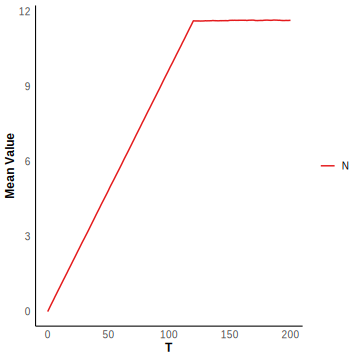
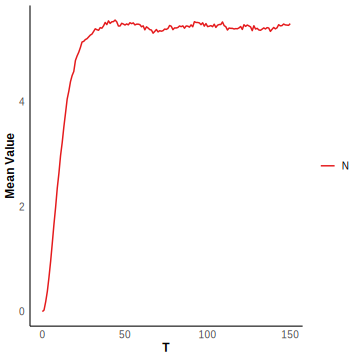

# Birth Death Model

We consider a non-Markovian system where mRNA are transcript at a rate $k$ and are removed from the system (degraded) after a fixed time delay $\tau$. For each mRNA, its $\tau$ follow a gamma distribution. This reaction scheme can be illustrated by

$$
\emptyset\stackrel{k}\rightarrow N, 
N\stackrel{\tau}\Rightarrow\emptyset.
$$

where $\tau\sim\text{Gamma}(7,1)$. Let $k=10$, $\tau\sim\text{Gamma}(7,1).$

```R
tmax <- 150
n_initial <- matrix(c(0),nrow = 1)
t_initial <- 0
S_matrix <- c(1)
S_matrix <- matrix(S_matrix,nrow = 1) 
S_matrix_delay <- c(-1)
S_matrix_delay <- matrix(S_matrix_delay,nrow = 1)
k <- c(10)
reactant_matrix <- matrix(c(0),nrow = 1)
delay_type <- matrix(c(2),nrow = 1)
delaytime_list <- list()
delaytime_list <- append(delaytime_list,rgamma(n = 1, shape = 7, rate = 1))
```

We simulate $10^4$ trajectories and calculate the mean value and probability distribution of $N$ at $t = 150$.

```R
sample <- 10000
result <- simulation_DelaySSA(algorithm = "DelayMNR", sample_size=sample, tmax=tmax, n_initial=n_initial, t_initial=t_initial, S_matrix=S_matrix, S_matrix_delay=S_matrix_delay, k=k, reactant_matrix=reactant_matrix, delay_type=delay_type , delaytime_list=delaytime_list)
```


# Bursty Model

We study the Bursty model which describes gene expression occurring in bursts, where multiple mRNA molecules are rapidly synthesized during short periods of high activity and will degrade after the fixed delay time $\tau$. The rate of gene expression occurs is given by the function $f(n)=\frac{ab^n}{(1+b)^{n+1}}$ for any integer $n$. This can be described by the reaction scheme:

$$
\emptyset\stackrel{\frac{\alpha b^i}{(1+b)^{i+1}}}\longrightarrow iN, ~~iN\stackrel{\tau}\Rightarrow\emptyset,~~i=1,2,3,...
$$

The specie is $N$. Let $i=1,\ldots,30,~\alpha=0.0282,\beta=3.46,\tau=120$.

```R
j <- 30
tmax <- 200
n_initial <- matrix(c(0),nrow = 1)
t_initial <- 0
S_matrix <- c(1:j)
S_matrix <- matrix(S_matrix,nrow = 1) 
S_matrix_delay <- -c(1:j)
S_matrix_delay <- matrix(S_matrix_delay,nrow = 1)
a <- 0.0282
b <- 3.46
k <- c(sapply(1:j, function(i) a * b^i / (1 + b)^(i + 1)))
reactant_matrix <- matrix(rep(0,j),nrow = 3)
delay_type <- matrix(rep(c(2),times=j),nrow = 1)
tau = 120
delaytime_list <- list()
for (i in 1:j) {
  delaytime_list <- append(delaytime_list,tau) 
}
```

We simulate $10^5$ trajectories and calculate the mean value and probability distribution at $t = 200$.

```R
sample <- 100000
result <- simulation_DelaySSA(algorithm = "DelayMNR", sample_size=sample, tmax=tmax, n_initial=n_initial, t_initial=t_initial, S_matrix=S_matrix, S_matrix_delay=S_matrix_delay, k=k, reactant_matrix=reactant_matrix, delay_type=delay_type , delaytime_list=delaytime_list)
```




# Oscillation Model

 We focus on a specific case known as the Oscillation model, which involves the following steps: (i) a protein $X$ is transcribed by a promoter, (ii) after a fixed time delay $\tau$, $X$ is converted into protein $Y$ through a series of unspecified biochemical processes, and (iii) $Y$ then binds to the promoter, reducing the transcription rate of $X$. This process can be represented by the following reaction scheme:

$$
\emptyset \xrightarrow{J_1(Y)} X,
X\stackrel{\tau}\Rightarrow Y,\\
Y\xrightarrow{J_2(Y)} \emptyset,

$$

The function $J_1(Y)$ and $J_2(Y)$ is defined as follows:

$$
\begin{aligned}
J_1(Y)=k_1S\frac{K^p_d}{K^p_d+Y^p},\\
J_2(Y)=k_2E_T\frac{Y}{K_m+Y}.
\end{aligned}
$$

The species are $X$ and $Y$. Let $k_1=1,k_2=1,S=1,E_T=1,K_d=1,K_m=1,p=2,\tau=20.$

```R
tmax <- 400
n_initial <- matrix(c(0,0),nrow = 2)
t_initial <- 0
S_matrix <- c(1,0,0,-1)
S_matrix <- matrix(S_matrix,nrow = 2) 
S_matrix_delay <- c(-1,1,0,0)
S_matrix_delay <- matrix(S_matrix_delay,nrow = 2)
k <- function(n){  k <- c(1/(1 + (n[2])^2), 1/(1 + n[2]))}
reactant_matrix <- matrix(c(0,0,0,1),nrow = 2)
delay_type <- matrix(c(2,0),nrow = 1)
delaytime_list <- list()
tau = 20
delaytime_list <- append(delaytime_list,c(tau,0))
```

We simulate $10^5$ trajectories and calculate the mean value and probability distribution at $t = 400$. 

```R
sample <- 100000
result <- simulation_DelaySSA(algorithm = "DelayMNR", sample_size=sample, tmax=tmax, n_initial=n_initial, t_initial=t_initial, S_matrix=S_matrix, S_matrix_delay=S_matrix_delay, k=k, reactant_matrix=reactant_matrix, delay_type=delay_type , delaytime_list=delaytime_list)
```

Use the following code to visualize the results.

```R
library("ggplot2")
Specie <- c("X","Y")
t=seq(0, tmax, by = 1)
t_initial = 0
num_columns <- nrow(result[[1]]$n_values)
data_list <- lapply(1:num_columns, function(i) {
  n <- lapply(t, function(x) plot_mean(result, i, x))
  n <- unlist(n)
  if (t[1] == t_initial) 
    n[1] <- n_initial[i, ]
  data.frame(t = t, quantity = n, Specie = Specie[i])
})
plot_data <- do.call(rbind, data_list)
ggplot(plot_data, aes(x = t, y = quantity, color = Specie)) + 
  geom_line(linewidth = 0.7) +  
  labs(x = "T", y = "Mean Value") + 
  scale_color_brewer(palette = "Set1") + 
  theme_minimal() + 
  theme(
    plot.title = element_text(hjust = 0.5, size = 14, face = "bold"),  
    axis.title = element_text(size = 12, face = "bold"),  
    axis.text = element_text(size = 10),  
    legend.title = element_blank(),  
    legend.text = element_text(size = 10), 
    panel.grid = element_blank(),  
    panel.background = element_blank(), 
    axis.line = element_line(color = "black")  
  )
```


```R
num_columns <- nrow(result[[1]]$n_values)
data_list <- lapply(1:num_columns, function(i) {
  n <- lapply(result, function(x) picksample(x, i, t=tmax))
  n <- unlist(n)
  plot_xy <- convert_pdf(n)
  if (!all(data.frame(percentage = plot_xy)[, 1] == data.frame(percentage = plot_xy)[,2])) {
    warning("Error in Calculating Density Table")
  }
  data.frame(quantity = data.frame(percentage = plot_xy)[,1], percentage = data.frame(percentage = plot_xy)[,3], Specie = Specie[i])
})
plot_data <- do.call(rbind, data_list)
ggplot(plot_data, aes(x = quantity, y = percentage, color = Specie)) + 
  geom_line(linewidth = 0.7) +  
  labs(x = "# of Products", y = "Probability") + 
  scale_color_brewer(palette = "Set1") + 
  theme_minimal() + 
  theme(
    plot.title = element_text(hjust = 0.5, size = 14, face = "bold"),  
    axis.title = element_text(size = 12, face = "bold"),  
    axis.text = element_text(size = 10),  
    legend.title = element_blank(),  
    legend.text = element_text(size = 10),  
    panel.grid = element_blank(), 
    panel.background = element_blank(), 
    axis.line = element_line(color = "black")  
  )
```


# Refractory Model

We also study the refractory model, which was devised to explain the experimental observation that the distribution of ‘‘off’’ intervals is not exponential but rather has a peak at a nonzero value. The gene state can change between $G_0$, $G_1$ and $G_2$, but gene expression only occurs at the state of $G_2$. The the mRNA will degrade after the fixed delay time $\tau$. This reaction scheme can be illustrated by

$$
G_0\xrightarrow{k_1} G1,~\\
G_1\xrightarrow{k_2}G_2,~\\
G_2\xrightarrow{k_3}G_0,~\\
G_2\xrightarrow{k_4}G_2+N,~
N\stackrel{\tau}\Rightarrow\emptyset
$$

The specie is $G_0,G_1,G_2,N$. Let $k_1 = 0.15,k_2 =  0.1,k_3 = 0.05,k_4 = 10, \tau = 1.$

```R
tmax <- 150
n_initial <- matrix(c(1,0,0,0),nrow = 4)
t_initial <- 0
S_matrix <- c(-1,1,0,0,0,-1,1,0,1,0,-1,0,0,0,0,1)
S_matrix <- matrix(S_matrix,nrow = 4) 
S_matrix_delay <- c(0,0,0,0,0,0,0,0,0,0,0,0,0,0,0,-1)
S_matrix_delay <- matrix(S_matrix_delay,nrow = 4)
k <- c(0.15,0.1,0.05,10)
reactant_matrix <- matrix(c(1,0,0,0,0,1,0,0,0,0,1,0,0,0,1,0),nrow = 4)
delay_type <- matrix(c(0,0,0,2),nrow = 1)
tau = 1
delaytime_list <- list()
delaytime_list <- append(delaytime_list,c(0,0,0,tau))
```

We simulate $10^4$ trajectories and calculate the mean value and probability distribution of $N$ at $t = 200$.

```R
sample <- 10000
result <- simulation_DelaySSA(algorithm = "DelayMNR", sample_size=sample, tmax=tmax, n_initial=n_initial, t_initial=t_initial, S_matrix=S_matrix, S_matrix_delay=S_matrix_delay, k=k, reactant_matrix=reactant_matrix, delay_type=delay_type , delaytime_list=delaytime_list)
```




