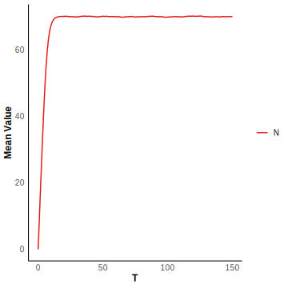
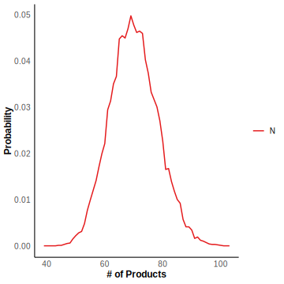

# Birth Death Model

We consider a non-Markovian system where mRNA are transcript at a rate $k$ and are removed from the system (degraded) after a fixed time delay $\tau$. For each mRNA, its $\tau$ follow a gamma distribution. This reaction scheme can be illustrated by

$$
\emptyset\stackrel{k}\rightarrow N, 
N\stackrel{\tau}\Rightarrow\emptyset.
$$

where $\tau\sim\text{Gamma}(7,1)$. Let $k=10$, $\tau\sim\text{Gamma}(7,1).$

```R
tmax <- 150
n_initial <- matrix(c(0),nrow = 1)
t_initial <- 0
S_matrix <- c(1)
S_matrix <- matrix(S_matrix,nrow = 1) 
S_matrix_delay <- c(-1)
S_matrix_delay <- matrix(S_matrix_delay,nrow = 1)
k <- c(10)
product_matrix <- matrix(c(0),nrow = 1)
delay_type <- matrix(c(2),nrow = 1)
delaytime_list <- list()
delaytime_list <- append(delaytime_list,rgamma(n = 1, shape = 7, rate = 1))
```

We simulate $10^4$ trajectories and calculate the mean value and probability distribution of $N$ at $t = 150$.

```R
sample <- 10000
result <- simulation_DelaySSA(algorithm = "DelayMNR", sample_size=sample, tmax=tmax, n_initial=n_initial, t_initial=t_initial, S_matrix=S_matrix, S_matrix_delay=S_matrix_delay, k=k, product_matrix=product_matrix, delay_type=delay_type , delaytime_list=delaytime_list)
```


