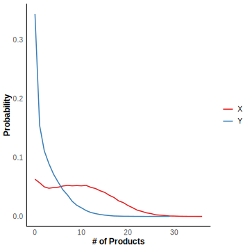

# Oscillation Model

In this section, we will give an example to illustrate the use of DelaySSA for defining chemical reaction models, solving associated problems, and visualizing the results. The source code for all examples and figures can be found in the GitHub examples folder. We focus on a specific case known as the Oscillation model, which involves the following steps: (i) a protein $X$ is transcribed by a promoter, (ii) after a fixed time delay $\tau$, $X$ is converted into protein $Y$ through a series of unspecified biochemical processes, and (iii) $Y$ then binds to the promoter, reducing the transcription rate of $X$. This process can be represented by the following reaction scheme:

$$
\emptyset \xrightarrow{J_1(Y)} X,
X\stackrel{\tau}\Rightarrow Y,\\
Y\xrightarrow{J_2(Y)} \emptyset,

$$

The function $J_1(Y)$ and $J_2(Y)$ is defined as follows:

$$
\begin{aligned}
J_1(Y)=k_1S\frac{K^p_d}{K^p_d+Y^p},\\
J_2(Y)=k_2E_T\frac{Y}{K_m+Y}.
\end{aligned}
$$

The species are $X$ and $Y$. Let $k_1=1,k_2=1,S=1,E_T=1,K_d=1,K_m=1,p=2,\tau=20.$

```R
tmax <- 400
n_initial <- matrix(c(0,0),nrow = 2)
t_initial <- 0
S_matrix <- c(1,0,0,-1)
S_matrix <- matrix(S_matrix,nrow = 2) 
S_matrix_delay <- c(-1,1,0,0)
S_matrix_delay <- matrix(S_matrix_delay,nrow = 2)
k <- function(n){  k <- c(1/(1 + (n[2])^2), 1/(1 + n[2]))}
product_matrix <- matrix(c(0,0,0,1),nrow = 2)
delay_type <- matrix(c(2,0),nrow = 1)
delaytime_list <- list()
delaytime_list <- append(delaytime_list,20)
delaytime_list <- append(delaytime_list,0)
```

We simulate $10^5$ trajectories and calculate the mean value and probability distribution at $t = 400$. 

```R
sample <- 100000
result <- simulation_DelaySSA(algorithm = "DelayMNR", sample_size=sample, tmax=tmax, n_initial=n_initial, t_initial=t_initial, S_matrix=S_matrix, S_matrix_delay=S_matrix_delay, k=k, product_matrix=product_matrix, delay_type=delay_type , delaytime_list=delaytime_list)
```

Draw the figures using the following code.

```R
Specie <- c("X","Y")
svg <- svglite("Oscillation_mean.svg", width = 5, height = 5)
t=seq(0, tmax, by = 1)
t_initial = 0
num_columns <- nrow(result[[1]]$n_values)
data_list <- lapply(1:num_columns, function(i) {
  n <- lapply(t, function(x) plot_mean(result, i, x))
  n <- unlist(n)
  if (t[1] == t_initial) 
    n[1] <- n_initial[i, ]
  data.frame(t = t, quantity = n, Specie = Specie[i])
})
plot_data <- do.call(rbind, data_list)
ggplot2::ggplot(plot_data, ggplot2::aes(x = t, y = quantity, color = Specie)) + 
  ggplot2::geom_line(linewidth = 0.7) +  
  ggplot2::labs(x = "T", y = "Mean Value") + 
  ggplot2::scale_color_brewer(palette = "Set1") + 
  ggplot2::theme_minimal() + 
  ggplot2::theme(
    plot.title = ggplot2::element_text(hjust = 0.5, size = 14, face = "bold"),  
    axis.title = ggplot2::element_text(size = 12, face = "bold"),  
    axis.text = ggplot2::element_text(size = 10),  
    legend.title = ggplot2::element_blank(),  
    legend.text = ggplot2::element_text(size = 10), 
    panel.grid = ggplot2::element_blank(),  
    panel.background = ggplot2::element_blank(), 
    axis.line = ggplot2::element_line(color = "black")  
  )
dev.off()
svg <- svglite("Oscillation_density_400s.svg", width = 5, height = 5)
num_columns <- nrow(result[[1]]$n_values)
data_list <- lapply(1:num_columns, function(i) {
  n <- lapply(result, function(x) picksample(x, i, t=tmax))
  n <- unlist(n)
  plot_xy <- convert_pdf(n)
  if (!all(data.frame(percentage = plot_xy)[, 1] == data.frame(percentage = plot_xy)[,2])) {
    warning("Error in Calculating Density Table")
  }
  data.frame(quantity = data.frame(percentage = plot_xy)[,1], percentage = data.frame(percentage = plot_xy)[,3], Specie = Specie[i])
})
plot_data <- do.call(rbind, data_list)
ggplot2::ggplot(plot_data, ggplot2::aes(x = quantity, y = percentage, color = Specie)) + 
  ggplot2::geom_line(linewidth = 0.7) +  
  ggplot2::labs(x = "# of Products", y = "Probability") + 
  ggplot2::scale_color_brewer(palette = "Set1") + 
  ggplot2::theme_minimal() + 
  ggplot2::theme(
    plot.title = ggplot2::element_text(hjust = 0.5, size = 14, face = "bold"),  
    axis.title = ggplot2::element_text(size = 12, face = "bold"),  
    axis.text = ggplot2::element_text(size = 10),  
    legend.title = ggplot2::element_blank(),  
    legend.text = ggplot2::element_text(size = 10),  
    panel.grid = ggplot2::element_blank(), 
    panel.background = ggplot2::element_blank(), 
    axis.line = ggplot2::element_line(color = "black")  
  )
dev.off()
```


