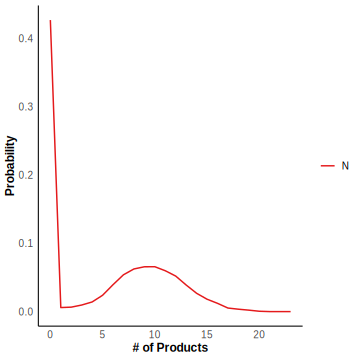

# Refractory Model

We also study the refractory model, which was devised to explain the experimental observation that the distribution of ‘‘off’’ intervals is not exponential but rather has a peak at a nonzero value. The gene state can change between $G_0$, $G_1$ and $G_2$, but gene expression only occurs at the state of $G_2$. The the mRNA will degrade after the fixed delay time $\tau$. This reaction scheme can be illustrated by

$$
G_0\xrightarrow{k_1} G1,~\\
G_1\xrightarrow{k_2}G_2,~\\
G_2\xrightarrow{k_3}G_0,~\\
G_2\xrightarrow{k_4}G_2+N,~
N\stackrel{\tau}\Rightarrow\emptyset
$$

The specie is $G_0,G_1,G_2,N$. Let $k_1 = 0.15,k_2 =  0.1,k_3 = 0.05,k_4 = 10, \tau = 1.$

```R
tmax <- 150
n_initial <- matrix(c(1,0,0,0),nrow = 4)
t_initial <- 0
S_matrix <- c(-1,1,0,0,0,-1,1,0,1,0,-1,0,0,0,0,1)
S_matrix <- matrix(S_matrix,nrow = 4) 
S_matrix_delay <- c(0,0,0,0,0,0,0,0,0,0,0,0,0,0,0,-1)
S_matrix_delay <- matrix(S_matrix_delay,nrow = 4)
k <- c(0.15,0.1,0.05,10)
reactant_matrix <- matrix(c(1,0,0,0,0,1,0,0,0,0,1,0,0,0,1,0),nrow = 4)
delay_type <- matrix(c(0,0,0,2),nrow = 1)
delaytime_list <- list()
delaytime_list <- append(delaytime_list,0)
delaytime_list <- append(delaytime_list,0)
delaytime_list <- append(delaytime_list,0)
delaytime_list <- append(delaytime_list,1)
```

We simulate $10^4$ trajectories and calculate the mean value and probability distribution of $N$ at $t = 200$.

```R
sample <- 10000
result <- simulation_DelaySSA(algorithm = "DelayMNR", sample_size=sample, tmax=tmax, n_initial=n_initial, t_initial=t_initial, S_matrix=S_matrix, S_matrix_delay=S_matrix_delay, k=k, reactant_matrix=reactant_matrix, delay_type=delay_type , delaytime_list=delaytime_list)
```


